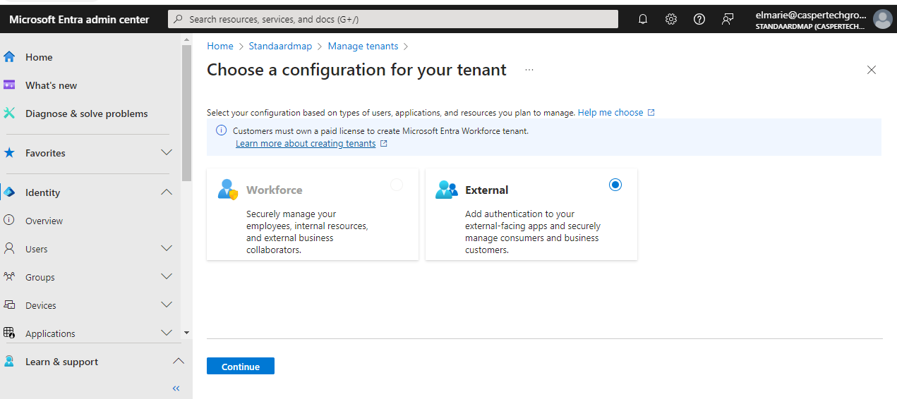
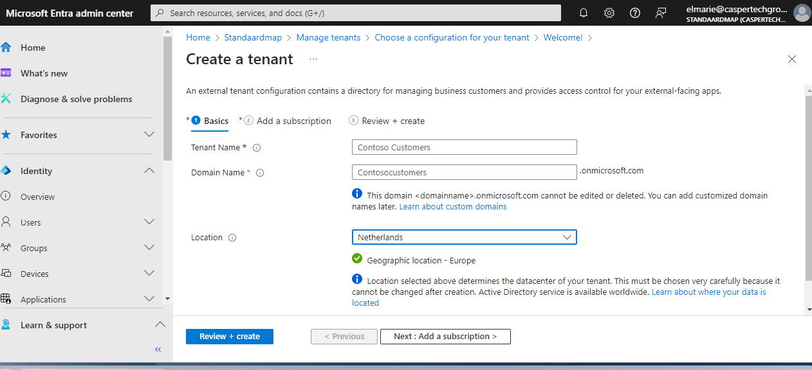
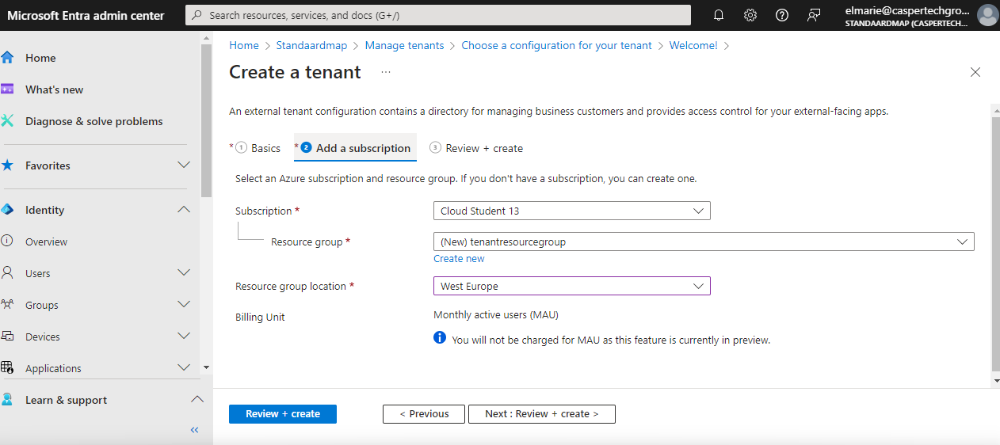
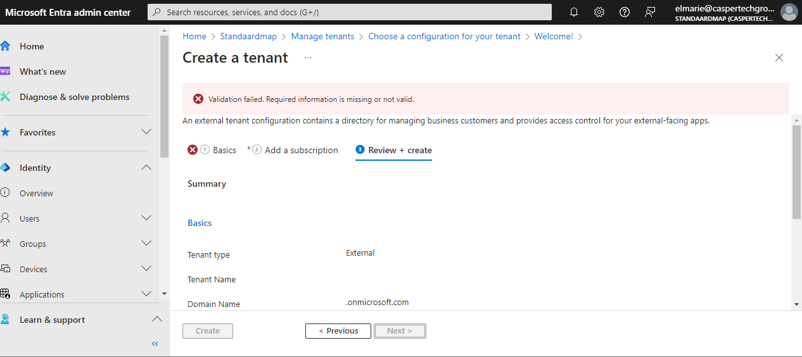
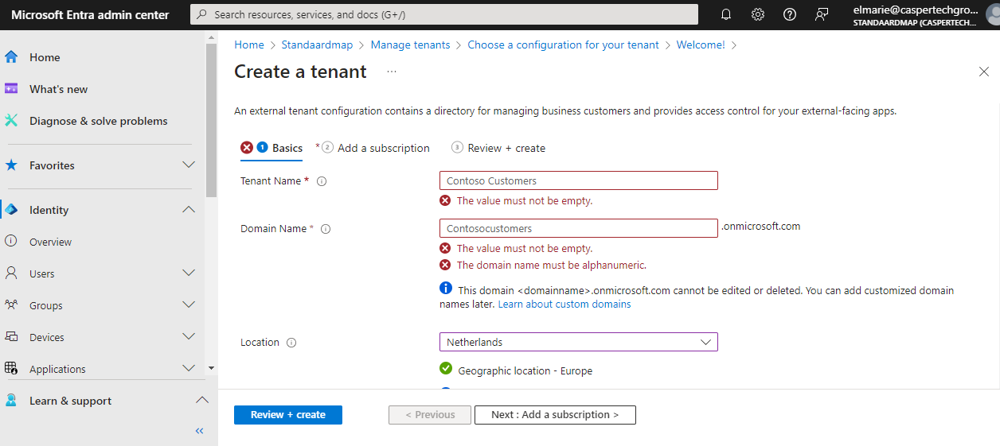

## Subject
From this moment on, you will receive fewer concrete assignments. We will rely more on your independent learning skills. Don't worry, you're not alone. You have each other, and the established structure remains where you can still ask everyone for help.

Some services you only need to know theoretically. Others you should have turned on and configured at least once. Each topic describes whether it is a theoretical or practical subject.

Useful questions to keep in mind during your research on the topics:

What problem does X solve?

What key terms are associated with X?

How does X fit into / replace X in an on-premises setting?

How can I combine X with other services?

What is the difference between X and other similar services?

A handy list of tasks you need to be able to perform practically:

Where can I find this service in the console?

How do I turn on this service?

How can I connect this service to other resources?

## Assignment

Gain practical experience with:

Microsoft Entra ID

##  Key Terms

##  Resources

[Microsoft External ID Tenant Setup](https://learn.microsoft.com/en-us/entra/external-id/customers/quickstart-tenant-setup)

##  Difficulties

I planned to do the Quickstart for Microsoft Entra ID but when I looked at this, I realizied that in order to follow the Quickstart Guide for this, I would first need to create an external tenant.  So I adjusted my time allocation for this task accordingly and started with this crucial prerequisite.

##  Results

###  First, I created a new tenant with external configurations:

I logged into the Micrsoft Entra Admin center and then I browsed to Identity > Overview > Manage tenants.  I selected the External option:

I changed the location on the Basics Tab and left the other options as default:

Here I changed the location:

When I tried to Create the tenant, I got an error message:

I was delighted that for once the error was obvious and easy to find and fix: the fields that appeared to me to have default values in were blank:

Once I filled in the missing values, the tenant creation was succesfully validated:

And I was able to navigate to my external tenant in the Microsoft Entra Admin Centre:

###  Next, I customized the Sign-In Experience:

In Microsoft Entra Admin Centre, I browsed to Home>Tenant Overview>Start the Guide.

Next, I specified how I would like my customers to sign in and I chose Email and password, and then customised the log in screen by adding a logo and changing the background colour:

###  I tried out the Sign-Up experience and created my first user:

Here is a screenshot of my sign-in page:

I received an email with a verification code :

And here I've entered my details:

